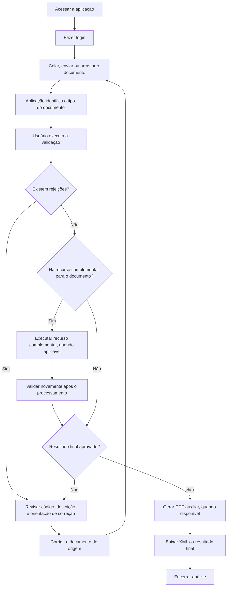

# Validador Fiscal

Documentação funcional pública da aplicação de validação de documentos fiscais.

Este repositório público contém apenas:

- regras de negócio
- orientações de uso
- tipos de documento suportados
- interpretação de rejeições e alertas

Este repositório **não** publica:

- código-fonte
- detalhes de infraestrutura
- fluxos de deploy
- credenciais
- endpoints internos
- configurações sensíveis

## Fluxo de uso ponta a ponta

## Índice

- [Como usar](como-usar.md)
- [Regras de negócio](regras-de-negocio.md)
- [Documentos suportados](documentos-suportados.md)
- [Resultados e rejeições](resultados-e-rejeicoes.md)
- [Tabelas de rejeições por documento](tabelas-rejeicoes-por-documento.md)
