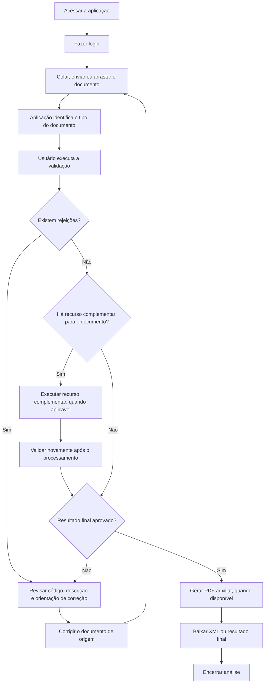

# Validador Fiscal

Documentação funcional pública da aplicação de validação de documentos fiscais.

Este portal publica apenas conteúdo funcional e sanitizado:

- regras de negócio
- orientações de uso
- fluxos operacionais
- documentos suportados
- interpretação de rejeições e alertas

Este portal **não** publica:

- código-fonte
- detalhes de infraestrutura
- fluxos de deploy
- credenciais
- endpoints internos
- configurações sensíveis

## Fluxo de uso ponta a ponta

## Estrutura do portal

- [Fluxos](fluxos/validacao-de-documentos.md)
- [Operação](operacao/cadastro-e-login.md)
- [Regras de negócio](regras/gerais/visao-geral.md)
- [Documentos suportados](regras/gerais/documentos-suportados.md)
- [Rejeições por documento](rejeicoes/indice.md)
- [FAQ](faq/duvidas-frequentes.md)
